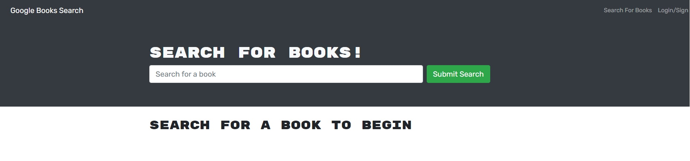

# MERN-GraphQL-Book-Search-Engine

Currently a work in progress

## Applicaiton

The application allows a user to search the Google Books API and save their favorite books. They can then view previously-saved books.

## Current Development

API paradigm is under conversion from RESTful to graphQL. Users can log in and save books, but they cannot view books previously saved.

The application is deployed to heroku, though currently it suffers an error that prevents use.

It is deployed [here](https://safe-escarpment-51233.herokuapp.com/)

## Future Development

Fixing remaining graphQL implementation, which seems to hang up at user authentication, as well as debugging the heroku app error, are currently top priority.

